# Results

Here, I will compare the results I got with my implementation with the one described in [the article written by deepmind in 2013][DM_PAPER] (later refered as "the article"). All the simulations will be run against the game Breakout using parameters that will be descirbed later. The idea behind this section is to investigate how the input parameters can influence the final results. Indeed, while implementing this agent, a few choices had to be made and, even if it's obvious that the first agent produced was able to learn a good policy, I am curious to see if it can significantly be improved.

  1. [Introduction](#introduction)
    1. [Breakout](#breakout)
    2. [Score vs Rewards](#score-vs-rewards)
    3. [Testing the agent](#testing-the-agent)
    4. [Differences between this implementation and the agent developped by Deepmind](#differences-between-this-implementation-and-the-agent-developped-by-deepmind)
    5. [Default parameters](#default-parameters)
  2. [The tests](#the-tests)
    1. [Influence of the initialization](#influence-of-the-initialization)
  3. [References](#references)

## Introduction
### Breakout

Breakout is a game developped by Atari in 1976 and ported on Atari 2600 in 1978[2]. In that version, the game is made of a ball, a paddle and six rows of briks. The ball bounce on everything that is not black (i.e the paddle, the bricks and the walls) and destroys a bricks everytime it touches it. Everytime the ball reaches the bottom of the screen, the player looses one life. The game ends once the player has lost all its lives (the life labelled "0" count for one) or when it clears all the bricks.

The rows of are made of 18 bricks each and every one of them destroyed bring points which amount depends on its color (see Tab.1).

<table>
  <tr>
    <td>
      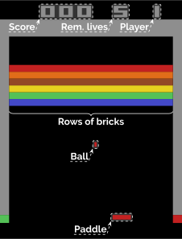
    </td>
    <td>
      
    </td>
    <td>
      <table>
        <tr><th>Bricks</th><th>Score  </th></tr>
        <tr><td>Blue  </td><td>1 point</td></tr>
        <tr><td>Green </td><td>1 point</td></tr>
        <tr><td>Yellow</td><td>4 point</td></tr>
        <tr><td>Brown </td><td>4 point</td></tr>
        <tr><td>Orange</td><td>7 point</td></tr>
        <tr><td>Red   </td><td>7 point</td></tr>
      </table>
    </td>
  </tr>
  <tr>
    <td><i>Fig.1: Breakout layout</i></td>
    <td><i>Fig.2: <a href="https://youtu.be/MTnhlAlzb6Y">
        Capture of someone playing breakout[3]</a></i></td>
    <td><i>Tab.1: List of possible scores</td>
  </tr>
</table>

### Score vs Rewards

For each frame, [Arcade Learning Environment (ALE)][ALE_HOMEPAGE] returns the points gained thanks to the last action performed. Just as suggested in the article (section 5), one action taken by the agent is repeated for four frames. Therefore, we call the score associated to one action the sum of the points returned by ALE for all the repetitions of this action. The total score for one game will be the sum of the scores got for every actions.

In the same section, it's also explained that the reward received by the agent for one action is either one, minus one or zero depending on wether the score for that action is respectively either positive, negative or null. Unlike in the article, I will keep this distinction between score and reward not only during the training, but also during the test.

Indeed, according to what has been said in the previous section about the score, we easilly conclude that the maximum reward (i.e. the number of bricks) is 108 and the maximum score (i.e. the score got after destoying all the bricks) is 432. Therefore, while the plots in the figure 2 of the article and the results reported in the table 1 are indicated as being "rewards", they are actually "scores" as defined above.

### Testing the agent

The protocol used to test the performance of the agent while it's learning is the same as the one described in the article, figure 2 and is recalled here. Two kind of tests are performed. The first one tends to picture the evolution of the Q function by computing the Q-Values for a set of state-action pairs drawn randomly before starting the training. The mean of all the Q values (QAvg) and the mean of the maximum Q values for each state-action pairs (QMaxAvg) are then computed. This test set contains of 5000 elements.

The second test consists in playing for 10000 iterations applying an &epsilon;-greedy strategy with &epsilon; = 0.05. The scores and the rewards are collected and averaged once all the games have been played.

These two tests are run once every 50000 iterations (one epoch), i.e. everytime after the agent has been trained 50000 times.

### Differences between this implementation and the agent developped by Deepmind

This implementation of the agent differs slightly from the Deepmind's one as described in the article. First, the input of the network: in order to build their input, Deepmind follows the algorithm below:

  1. Collect the last four frames returned by the environment
  2. Convert each frame from 3 channels RGB images to one channel gray-scale images
  3. Resample each frame from 210x160 pixels (native Atari size) to 110x84 pixels images
  4. Crop an 84x84 region of each frame that roughly capture the playing area

My implementation follows this algorithm except for the last two steps where I directly resample the frames to 84x84 pixels images. Cropping may result in a lost of important data and require to know the game in order to determine what is the playing area and I wanted to avoid that.

Another difference is the configuration of ALE. As explained in the section 5 of the article, Deepmind choose to repeat every chosen action for four frames. However, they noticed that this value of four didn't work with the space invader, because the Atari 2600 used to display some sprites once every two frames (in that case, the lasers). They solved that problem by skiping three frames instead of four for this particular game. It appears that the modern versions of ALE come with a parameter called "color averaging". When activated, this functionality makes that the environment always returns a frame that is actually the average of the two last frames produced by the emulator. I choose to activate this function, which should solve the problem while keeping the same frame skipping for every games.

Finally, there's no mention of any gradient technique clipping used in their paper. However, I needed to use one in order the algorithm to converge. I choose to clip the norm of the gradient. If the L2 norm of the gradient is higher than a threshold, then the gradient is normalized and multiplied by this threshold.

### Default parameters

Here is how the agent is pamameterized by default:

#### Network

The default network initializes its weights by the method called Xavier and its biases to 0 and has the following structure:

<table>
  <tr>
    <td></td>
  </tr>
  <tr>
    <td><i>Fig.3: Structure of the deep Q network </i></td>
  </tr>
</table>

  * The input is made of 4 frames of 84x84 pixels in 8 bits gray-scale that are normalized to 32 bits float  between 0 and 1
  * The first layer (L1) is a convolutional layer with 16 filters of size 8x8 performing a convolution with a stride of 4x4 and applying a ReLU function to the result
  * The second layer (L2) is a convolutional layer with 34 filters of size 4x4 performing a convolution with a stride of 2x2 and applying a ReLU function to the restult
  * The third layer (L3) is a fully connected layer made of 256 units that applies a ReLU function to the result
  * The fourth and last layer is a fully connected layer made of a number of unit equals to the number of actions. In the case of the game Breakout, we take the minimal set of action, that is 4 actions ("left", "right", "fire", "no action"). The activation function for this layer is the identity function
  * For each convolution, a "full" padding is applied. That is the filters are applied wherever they partly overlap with the input (see the [Theano documentation about 2D convolutions][THEANO_CONV2D])

#### Optimizer

| Parameter               | Value                |   | Parameter       | Value |
|-------------------------|----------------------|---|-----------------|-------|
| Optimizer               | [RMSProp][RMSPROP]   |   | &epsilon; *     | 1e-6  |
| Momentum (&beta;)       | 0                    |   | Decay (&gamma;) | 0.99  |
| Learning rate (&alpha;) | 0.00025              |   |                 |       |

 * This &epsilon; is not the same as the one used when applying an &epsilon;-greedy strategy. As explained in the RMSProp algorithm, this is just an small number used to prevent deviding by 0.

#### Learning

| Parameter                  | Value                |   | Parameter       | Value    |
|----------------------------|----------------------|---|-----------------|----------|
| Replay memory size         | 200000               |   | Reward clipping | {-1,0,1} |
| Discount factor            | 0.95                 |   | Minibatch size  | 32       |
| &epsilon;max *  | 1                    |   | &epsilon;min * | 0.1      |
| &epsilon; last iteration * | 1000000              |   |                 |          |

 * While learning, the agent applies an &epsilon;-greedy policy with a value of &epsilon; starting at its maximum value and decreasing linearly to reach its minimum possible value at the given last iteration.

#### Playing

| Parameter               | Value                |   | Parameter        | Value |
|-------------------------|----------------------|---|------------------|-------|
| Frame skipping          | 4                    |   | Random actions * | 30    |
| Observation **          | 5000                 |   |                  |       |

 * When the agent starts a new game it takes a number "n" of random actions before playing. By default, "n" is a randomly drawn between 0 and the value given here. For the tests, "n" is set to 0

 ** Number of frames observed before starting the training. While observing, the agent takes random actions and starts to populate the replay memory.

## The tests

Several tests will now be performed playing breakout and changing one parameter for every test. The results will then be compared for various value of this parameter. Every result will also be compared to the one acheived by Deepmind. Here under, is a replica of the graph that can be found page 7 of the article. The data for all the tests and for that graph can be found in the folder "datas". Please note that the data related to the agent originally created by Deepmind have been gathered after analyzing the pictures on the pdf of the article. Therefore, while the actual results should be close the the one presented here, they might differ slightly. The second plot is the results I could acheived with the default parameters

<table>
  <tr>
    <td>
      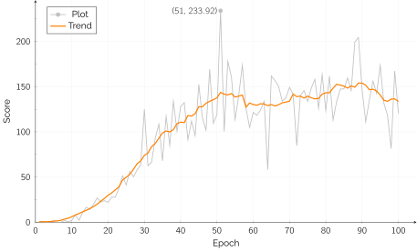
    </td>
    <td>
      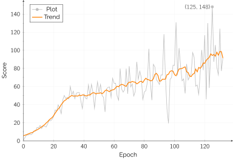
    </td>
  </tr>
  <tr>
    <td><i>Fig.4: The evolution of the score of the agent developped by Deepmind through the Epochs * </i></td>
    <td><i>Fig.5: The evolution of the score of the agent implemented here using the default parameters</i></td>
  </tr>
</table>

 * See the [Testing the agent](#testing-the-agent) section for a detailed explaination of the test protocol.

The plot displayed in the figures 4 and 5, and on the folowing figures as well, shows the raw datas collected while playing (in gray) and a trend these datas tends to follow (in orange). The trends are computed using a very simple algorithm that averages, for every x, the 'n' previous and the 'n' next y values. For the points which absice is too close to the boundaries (i.e. "x &le; n" or "x &ge; xmax - n"), the average value is computed up to the boundary. Here 'n' has been arbitrarily set to 6.

If it's clear that my agent is learning, the first thing we notice while observing the figures 3 and 4 is that its learning rate is much lower than the one of the agent made by Deepmind from epoch 20~25.

### Influence of the initialization

First, let's see how the results can be influenced by the initialization of the network. By default, the agent uses a Xavier initialization for its weights and its biases are initialized to 0.

Here, two other initialization method will be tried: (1) the weights and biases both follow a normal distribution of mean 0 and of standard deviation 0.01 and (2) both the weights and the biases are uniformly randomly chosen in the range [-0.01;0.01].

<table>
  <tr>
    <td>
      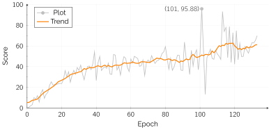
    </td>
    <td>
      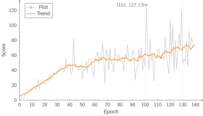
    </td>
  </tr>
  <tr>
    <td><i>Fig.6: Results when the agent is initilized following a
           <b>normal</b> distribution (1)</i></td>
    <td><i>Fig.7: Results when the agent is initilized following a
           <b>uniform</b> distribution (2)</i></td>
  </tr>
</table>

In both cases, the learning is still there. However, the results are still not as good as what Deepmind could acheived and are even worst than what we got with the default parameters. The next figure pictures this by comparing the trends of the different plots.

<table>
  <tr>
    <td>
      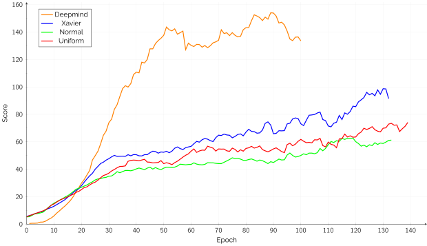
    </td>
  </tr>
  <tr>
    <td><i>Fig.8: Comparison of the original results with this implementation
    using three different initialization methods</i></td>
  </tr>
</table>

In the last figure, the red, the blue and the green curves are quite close and while they seem to indicate that the Xavier initialization method allows to reach better performance, it looks like that, as expected, just working on the initialization will not make it possible to reach the same results as Deepmind. However, we note that all the curves meet at the epoch 20, which is an epoch where a few things actually happen. Indeed, this is at that time that &epsilon; reaches its minimum, as this epoch matches with the first million of iteration. This is also the epoch when the Deepmind's agent has completelly filled its replay memory and starts to overwrite the oldest experiences (my agent holding only 200000 experiences, for the non orange curves, this happens after only 4 epochs). It could be interesting to rework on the data structure storing the past experiences in order to be able to increase its maximum size while fitting into the memory and to see how the replay memory size can influences the results.

The next figures show the best and worst games done over 1000 games for each initialization methods after the agent has been trained for 100 epochs.

<table>
  <tr>
    <td>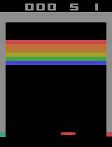</td>
    <td></td>
    <td>
      <table>
        <tr><th>Game </th><th>Score  </th></tr>
        <tr><td>Best </td><td>351    </td></tr>
        <tr><td>Worst</td><td>17     </td></tr>
        <tr><td>Mean </td><td>118.007</td></tr>
      </table>
    </td>
  </tr>
  <tr>
    <td><i>Fig.9: Best performance of the agent initialized using the
           <b>xavier</b> method and trained for <b>100 epochs</b></i></td>
    <td><i>Fig.10: Worst performance of the agent initialized using the
           <b>xavier</b> method and trained for <b>100 epochs</b></i></td> 
    <td><i>Tab.2: Results</i></td>
  </tr>

  <tr>
    <td></td>
    <td></td>
    <td>
      <table>
        <tr><th>Game </th><th>Score </th></tr>
        <tr><td>Best </td><td>366   </td></tr>
        <tr><td>Worst</td><td>16    </td></tr>
        <tr><td>Mean </td><td>73.913</td></tr>
      </table>
    </td>
  </tr>
  <tr>
    <td><i>Fig.11: Best performance of the agent initialized using a
           <b>normal</b> distribution and trained for <b>100 
           epochs</b></i></td>
    <td><i>Fig.12: Worst performance of the agent initialized using a
           <b>normal</b> idistribution and trained for <b>100 
           epochs</b></i></td> 
    <td><i>Tab.3: Results</i></td>
  </tr>

  <tr>
    <td>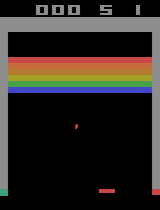</td>
    <td></td>
    <td>
      <table>
        <tr><th>Game </th><th>Score </th></tr>
        <tr><td>Best </td><td>342   </td></tr>
        <tr><td>Worst</td><td>9     </td></tr>
        <tr><td>Mean </td><td>54.899</td></tr>
      </table>
    </td>
  </tr>
  <tr>
    <td><i>Fig.13: Best performance of the agent initialized using a
           <b>uniform</b> distribution and trained for <b>100 
           epochs</b></i></td>
    <td><i>Fig.14: Worst performance of the agent initialized using a
           <b>uniform</b> idistribution and trained for <b>100 
           epochs</b></i></td> 
    <td><i>Tab.4: Results</i></td>
  </tr>
</table>

And, finally, the figures bellow plot the distributions of the score got while playing the 1000 games previously described.

<table>
  <tr>
    <td>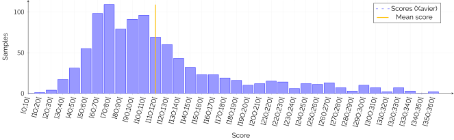
  </tr>
  <tr>
    <td><i>Fig.15: Distribution of the scores of the agent initialized using 
           the <b>xavier</b> method and trained for <b>100 epochs</b>, after
           playing <b>1000 games</b></i></td>
  </tr>
  <tr>
    <td>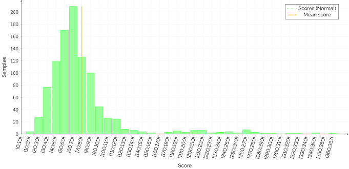
  </tr>
  <tr>
    <td><i>Fig.16: Distribution of the scores of the agent initialized using 
           a <b>normal</b> distribution and trained for <b>100 epochs</b>,
           after playing <b>1000 games</b></i></td>
  </tr>
  <tr>
    <td>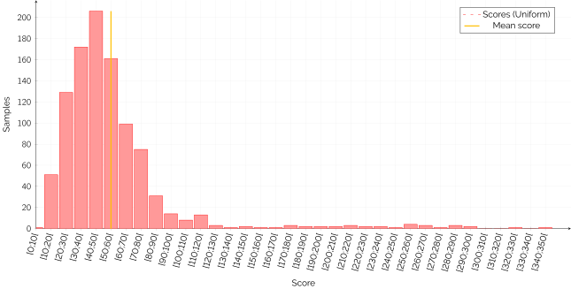
  </tr>
  <tr>
    <td><i>Fig.17: Distribution of the scores of the agent initialized using 
           a <b>uniform</b> distribution and trained for <b>100 epochs</b>,
           after playing <b>1000 games</b></i></td>
  </tr>
</table>

## References

[1] [Playing Atari with Deep Reinforcement Learning][DM_PAPER]

[2] [The wikipedia page about breakout][BREAKOUT_PAGE]

[3] [Breakout gameplay (video)][BREAKOUT_GAMEPLAY]

[4] [RMSProp Algorithm][RMSPROP]

[5] [Theano documentation (v0.9dev)][THEANO_DOC]

[ALE_HOMEPAGE]: http://www.arcadelearningenvironment.org/
[BREAKOUT_PAGE]: https://en.wikipedia.org/wiki/Breakout_(video_game)
[BREAKOUT_GAMEPLAY]: https://youtu.be/MTnhlAlzb6Y
[DM_PAPER]: https://arxiv.org/abs/1312.5602
[RMSPROP]: http://www.tuicode.com/article/56f1d50ebed2857f1c19238f
[THEANO_CONV2D]: http://deeplearning.net/software/theano_versions/dev/library/tensor/nnet/conv.html#theano.tensor.nnet.conv2d
[THEANO_DOC]: http://deeplearning.net/software/theano_versions/dev/index.html
